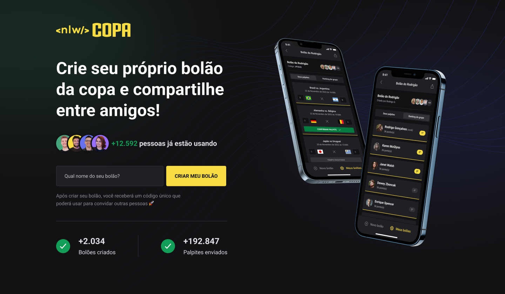
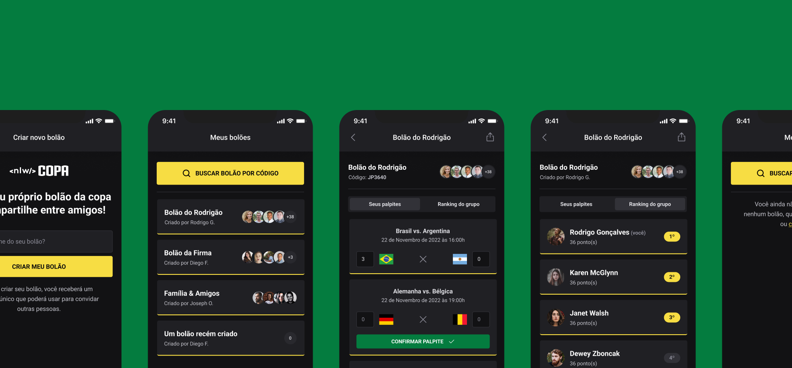

# Sweepstake Cup




This project was initially developed in the Next Level Week — a free event promoted by [Rocketseat](https://github.com/Rocketseat). It allows you to create sweepstakes on soccer matches with your friends.

## Getting started

These instructions will get you a copy of the project up and running on your local machine for development and testing purposes.

You will need to have Node and `npm` (or other package manager) installed in your machine.

Clone the repository to your local machine:

```shell
git clone https://github.com/samuelastech/sweepstake-cup.git
```

### Setting up the server

Go into `server` and install its dependencies:

```shell
cd server
npm install
```

Create a `.env` file and setup the environment variables — see `.env.example`.
Run the server:

```shell
npm run dev
```

### Setting up the mobile app

Go into `mobile` and install its dependencies:

```shell
cd mobile
npm install
```

Create a `.env` file and setup the environment variables — see `.env.example`.

Start the application:

```shell
npm start
```

Install [Expo](https://play.google.com/store/apps/details?id=host.exp.exponent&hl=pt_BR&gl=US) app in your smartphone and scan the QR Code that will shown up in your terminal.

### Setting up the web application

Go into `web` and install its dependencies:

```shell
cd web
npm install
```

Run the application:

```shell
npm run dev
```

## Contributing

Here are some ways you can contribute:

- Report bugs and request features by opening an issue;
- Contribute code by opening a pull request;
- Improve the documentation by suggesting edits or creating new content;
- Help with testing by trying out new features and reporting any issues you encounter.

### Submitting pull requests

To submit a pull request, follow these steps:

1. Fork the repository and clone it to your local machine;
2. Create a new branch for your changes;
3. Make your changes and commit them to your branch;
4. Push your changes to your fork;
5. Open a pull request on the original repository.

When submitting a pull request, please make sure to follow these guidelines:

- Describe the changes you have made and the purpose of the changes in the pull request description;
- Make sure that your changes are properly tested and do not break any existing functionality;
- Keep the pull request small and focused on a single issue. If you have multiple changes that you would like to make, consider submitting them as separate pull requests.